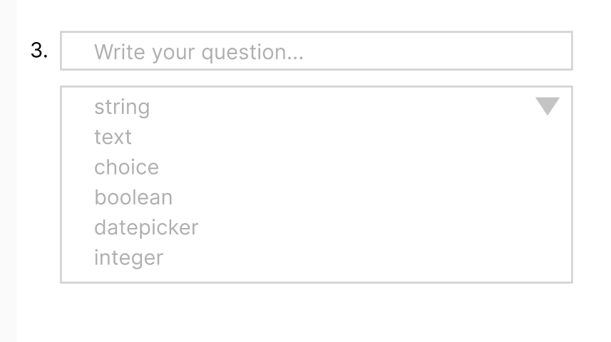

# Things I wish I knew... 

### Creating a Questionnaire item

[This is HL7 document page around questionnaire object](https://www.hl7.org/fhir/questionnaire.html)

When creating a [Questionnaire Item](https://www.hl7.org/fhir/questionnaire-definitions.html#Questionnaire.item) we need to choose which [Type](https://www.hl7.org/fhir/valueset-item-type.html) of item we want our question to be. 



Below is a code snippet from our code. We are trying to bind the Type property of ItemComponent to the selection from the dropdown shown above:

```c#
public Questionnaire.ItemComponent ItemComponent { get; set; }

private void GetOption(ChangeEventArgs e)
{
    int type = Int32.Parse(e.Value.ToString());
    
    // QuestionnaireItemType is an enum so we are able to type cast an Int
    ItemComponent.Type = (Hl7.Fhir.Model.Questionnaire.QuestionnaireItemType)(type);
}
```

Once the selection is made on the dropdown this is what we see:


As you can see, the value is 3, which is of 'Boolean' type:


However, this is what we see:


[This is the library we used](https://www.nuget.org/packages/Hl7.Fhir.R4/)
