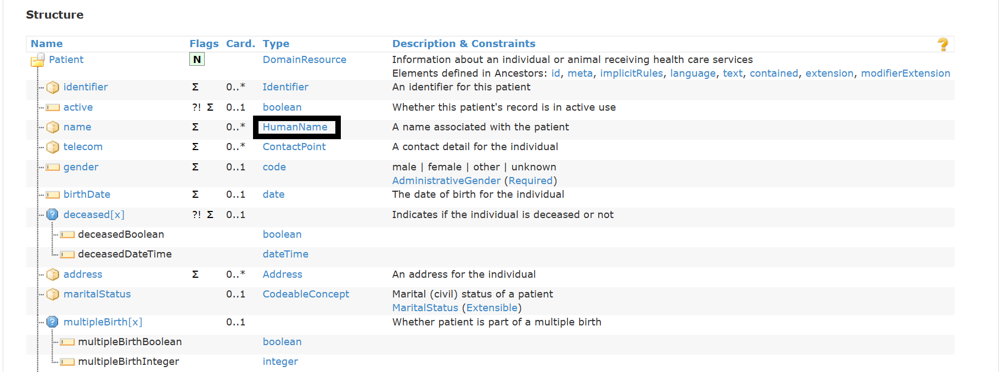

## Creating a FHIR Patient object in Blazor

The Firely SDK exposes a number of [models](https://docs.simplifier.net/projects/Firely-NET-SDK/model.html#fhir-model) that map to FHIR resources. For this project we built basic CRUD operations on the Patient Model. However due to it's complex nature, the Hl7.Fhir.Model.Patient model does not easily bind to the Blazor [EditForm](https://docs.microsoft.com/en-us/aspnet/core/blazor/forms-validation?view=aspnetcore-5.0).

To address this we built a customer model called SimplePatient that we bound to the Blazor form.
```csharp
public class SimplePatient
{
    public string FirstName { get; set; }
    public string LastName { get; set; }
    public string PatientID { get; set; } 
    public DateTime Birthdate { get; set; } 
}
```
This means we had to build a way to map the values from the Hl7.Fhir.Model.Patient to the SimplePatient model for displaying on the form and then map from SimplePatient to Hl7.Fhir.Model.Patient when posting the information back to the server.

This sample code shows how we mapped our SimplePatient to the Hl7.Fhir.Model.Patient model.

```csharp
public Patient ToHl7Patient()
{
    var Patient = new Patient();
    var PatientName = new HumanName();
    PatientName.Use = HumanName.NameUse.Usual;
    var namelist = new[] { FirstName };
    PatientName.Given = namelist;
    PatientName.Family = LastName;
    Patient.Name.Add(PatientName);
    var PatientIdentifier = new Identifier();
    PatientIdentifier.System = "http://hlsemops.microsoft.com";
    PatientIdentifier.Value = PatientID;
    Patient.Active = true;
    Patient.BirthDate = Birthdate.ToString("yyyy-MM-dd");
    Patient.Identifier = new List<Hl7.Fhir.Model.Identifier>();
    Patient.Identifier.Add(PatientIdentifier);
    Patient.Id = PatientID;
    return Patient;
}
```

This worked well overall although we did run into a few bugs with our mapping code that resulted in some intresting errors from our Fhir client.

Mapping to/from the Hl7.Fhir.Model.Patient should have been relatively straight forward. However the complex/nested structure of the model makes it tricky to work with. Looking at the Patient resource documentation, you notice that the patient name is a nested object of type of HumanName.



The HumanName has the underlying information, but you notice some of the attributes can have more than one value. For example "given" name. While "family" name can either be empty or at most a single value.


This gives the spec flexibility, but it makes extracting a simple element such as a patient name tricky. Here's something I thought would work and banged my head a few times to get it to work.

```csharp
EditPatient = new SimplePatient
{
    PatientID = SelectedPatient.Id,
    FirstName = SelectedPatient.Name[0].given.Value,
    LastName = SelectedPatient.Name[0].family.Value,
    Birthdate = DateTime.Parse(SelectedPatient.BirthDate)
};
```

We were able to resolve this by using the LINQ library. This should have been the right approach all along, it just took us a while to get there.

```csharp
var name = SelectedPatient.Name.FirstOrDefault();

EditPatient = new SimplePatient
{
    PatientID = SelectedPatient.Id,
    FirstName = name?.Given.FirstOrDefault(),
    LastName = name?.Family,
    Birthdate = DateTime.Parse(SelectedPatient.BirthDate)
};
```

Overall it worked well and we able to build an application that allows a user to create, update, search and delete patients backed by a Fhir service. Mission accomplished!