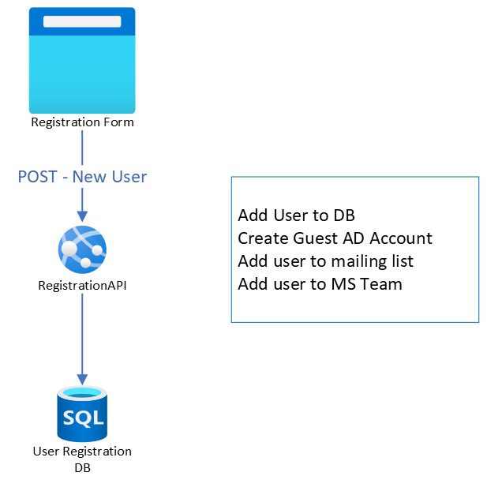
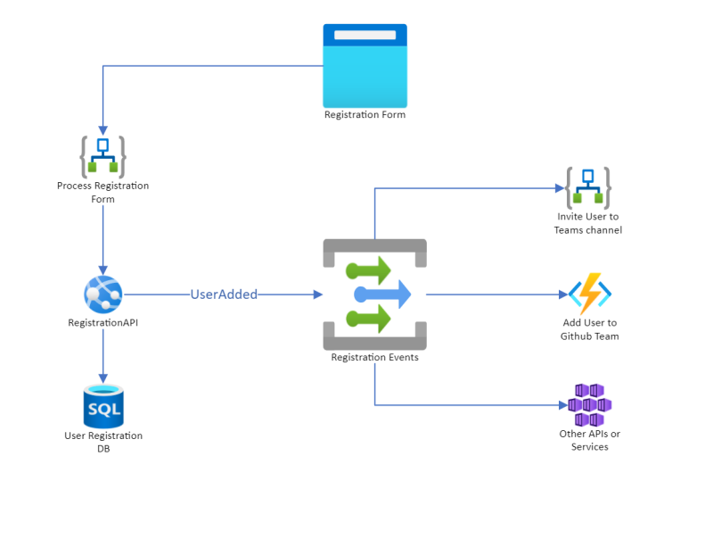

# EventGrid? Serverless? Why?

## Our Story

**Our legacy API (Hackathon registration service)** 

(Figure 1)

Figure 1 represents the architecture of our original Hackathon Registration service. It includes the following components:
1. Registration Form - A website which collects registration info from a new hackathon participant.
1. Registration API - An ASP.NET Core WebAPI providing CRUD over the registration data.
1. Registration DB - An Azure SQL Database to persist registration data.

Over time, additional functionality and business logic has been added to the legacy API. Some examples are:
* Adding a new user to a mailing list service (Mailchimp).
* Inviting new guest users to an Azure AD tenant.
* Adding a new user to a Microsoft Teams team and channels.

As more requirements were being asked, the more code we shoved into our codebase. Maintenance of the code is also becoming quit cumbersome. While the core functionality of collecting and storing user registration information remains constant, each hackathon event usually has its own requirements around the other capabilities. Some events want to use an alternate mailing list provider. Others want to configure a unique hierarchy for teams and channels. Our API codebase quickly started filling up with conditional statements and logical branches making it nearly impossible to test and difficult to maintain.

We want to decouple what we currently have into separate _components_. Components that are essential to the business logic and components that are ad-hoc and modifiable. This removes the need to bake unneccessary code into our base business logic. We decided to take a spike and design out how we can accomplish that using out of the box Azure services.  

## What does this have to do with me?

Though above is a small example we believe componentizing your architecture is a big step towards modernizing your architecture. 

We as developers believe in [Clean Code](https://dev.to/danialmalik/a-brief-guide-to-clean-code-functions-104h#:~:text=A%20Brief%20Guide%20to%20Clean%20Code%3A%20Functions%201,of%20the%20system%20while%20classes%20are%20the%20nouns.). We have to think software architecture, similarly. Each small components doing only what they are supposed to and pass it along to another. This helps us to architect cleaner and sensible solutions in the cloud. 

So, whether you are already on the cloud or thinking of modernizing your current architecture this article will hopefully give you a decent grasp of how you can go about approaching it the right way. 

## Options Options Options

### App Service
One of the quickest way to modernize your software is using App Service. VM is of course another route but going back to our reasoning we want to make sure things are small and manageable. This way you allow Azure to handle all the networking and security for you. Here are some great ways to secure your App Services! 
- [App Service Private Endpoint](https://docs.microsoft.com/en-us/azure/app-service/networking/private-endpoint)
- [App Service Access Restriction](https://docs.microsoft.com/en-us/azure/app-service/app-service-ip-restrictions)
- [App Service Environment](https://docs.microsoft.com/en-us/azure/app-service/environment/intro)

You can either host all your messy application in the App Service, OR you can refactor like mentioned above and put them into separate App Services and this gets into the territory of [Microservices](https://www.martinfowler.com/microservices/).

Did we mention the cost can be significantly cheaper?

### Serverless 
One step further than an app service route is the Serverless ([Azure Functions](https://docs.microsoft.com/en-us/azure/azure-functions/functions-overview))route. This is where Azure dynamically manages the allocation and provisioning of servers. All the benefit of the App Service but with added bonus of being only charged when it's invoked. Scott Guthrie calls it the '_invocation model_' where you are only responsible for chargers when the resource is called.

Now... the fun(?) part!

### Events and Messages 
As you manage multiple components event and messaging architecture becomes very important. 

- **Events** 
  - Think of it as a notification from System A to System B. 
- **Messaging** 
  - Think of it as a task given by System A to System B. 

Whichever direction you go you need a _Broker_. 

The broker we chose for our example is [Azure Event Grid](https://docs.microsoft.com/en-us/azure/event-grid/overview).

> [Checkout the doc](https://docs.microsoft.com/en-us/azure/event-grid/compare-messaging-services) which explains different event-driven services in Azure 

## Our Solution

(Figure 2)

Figure 2 represents the architecture of our refactored solution. The core functionality of the API is still there. But we have moved all the customizable supporting features out to their own services. In order to de-couple them from the original API, and orchestrate the business logic, an Event Grid Topic has been implemented. This service receives event notifications from the API when operations are performed on the registration data. Our supporting feature services can subscribe to these notifications to take the appropriate action when changes in the system occur.

### What are the benefits?
The immediate impact of this redesign is tremendous.

* Each component is completely autonomous. Interdependencies are de-coupled and cross-service communication is faciliated by a highly fault-tolerant messaging system.
* Cyclomatic Complexity of each component is greatly reduced. In some cases reaching a perfect score. This has the added benefit of making the code easier to test and easier for developers to understand.
* Updates to the system are much easier now. Each of the supporting services are "plug-n-play". For example, we can easily swap out the Mailchimp service for another service that interfaces with SendGrid. 
* EventGrid allows multiple subscriptions to the same event, which makes adding new features and layering in additional business logic a snap.

### The downside
You might be saying, "But now there are so many more 'things' to deal with!". Yes, that is true. But the benefits **FAR** out-weigh the downsides here. Cloud platforms (such as Azure) provide a wealth of governence and management tools out of the box that make it easy to provision, manage, and monitor 'all the things'.

### Lesson to be learnt
In hindsight I guess we got to this point because we didn't have a good design discussion when the api was being created. But I'm sure lot of development shops do similar things. In order to push code out, the design you think is going to last doesn't really do you any good, OR you just write code without designing at all! IT'S OK! The point is to *LEARN* from what you have built and try to continuously improve.

## The Final Word
Migrating legacy application architectures to the cloud sometimes requires a shift in perspective and thought-process. These cloud-native patterns can seem foreign and complicated at first. But with a little time and experience you will start to see the flexibility, scalability, and cost benefits of these designs.
