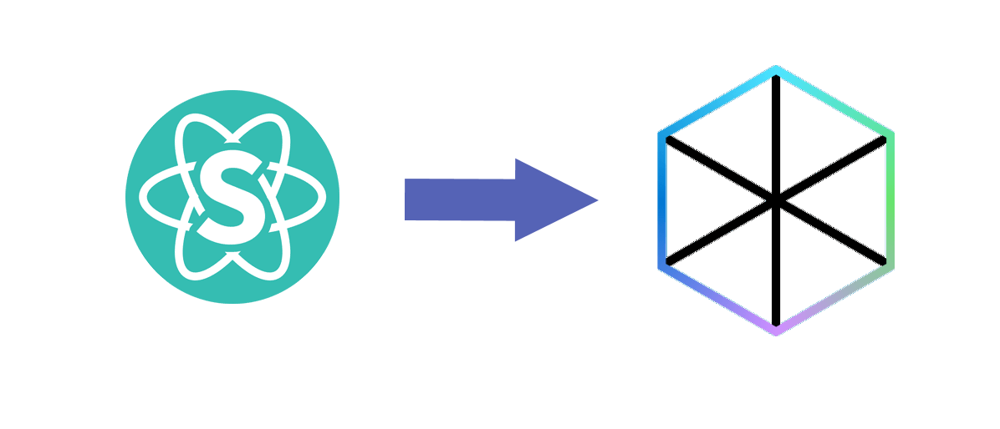

# Important Concepts to Keep in Mind when Migrating any UI Framework to Fluent UI
The migration process to Fluent UI can be somewhat tricky, but can be simplified significantly once you understand a few key points outlined below. 



# Table of contents


- [Table of contents](#table-of-contents)
- [Understanding Fluent UI](#Understanding-Fluent-UI)
- [Changing Styles](#Changing-Styles)
- [Using Knobs](#Using-Knobs)

# Understanding Fluent UI

Fluent UI provides extensible vanilla JavaScript solutions to component state, styling, and accessibility. These powerful features are exposed behind simple APIs based on natural language. There are a few differing versions of Fluent UI to be aware of, they are outlined below along with the scenarios in which they would best fit.

@fluentui/react - Best for building Office apps*
- Used by Outlook, SharePoint, Office (Word/PowerPoint/Excel), and more.
- Consolidating with @fluentui/react-northstar over time
- Default look and feel: Fluent
- Follows semantic versioning: Yes
- Release frequency: ~2 major release per year
- Break frequency: On major releases
- Use: For building experiences aligned with Office UX.

@fluentui/react-northstar - Best for building Teams apps*
- Used by Microsoft Teams, Teams Apps.
- Consolidating with @fluentui/react over time
- Default Look and Feel: Fluent - Teams
- Follows SemVer: Yes, but pre-release (only major releases)
- Release Frequency: As needed: ~Monthly
- Break Frequency: No more frequent than Monthly
- Use: Fast moving package for building experiences aligned with Teams UX.

*Both libraries are converging over time. Review the docs for each and choose the best starting point for you today.

There also is a @fluentui/react-next package that acts as a staging ground for components. This package should only be used for early testing and validation. It should not be used for production.

# Changing Styles
In order to change your style you will need to wrap a component around a provider.


```
const dontLeadButton = {
    siteVariables: {
      colorScheme: {
        brand: {
          'background': 'darkorange',
        }
      }
    }
  }
  <Provider theme={mergeThemes(teamsTheme, dontLeadButton)}>
                    <Button  primary
                      onClick={() => {
                        props.Callback(
                          false,
                          team.id,
                          team.teamName
                        );
                      }}
                    >
                      {leaveButtonText}
                    </Button>
                  </Provider>
```


# Using Knobs
While using knobs (such as in the example below) 
```
import {​​​​​ useBooleanKnob }​​​​​ from '@fluentui/docs-components'
```
You could potentially run into the following error:
```
Module not found: Can't resolve 'prettier/parser-babylon'
```
This is due to the fact that the dependancy 'prettier' (version >= 2.0) is not compatible with the plug-in 'prettier-plugin-import-sort'.

There are 2 ways to solve this issue, the first one is to downgrade 'prettier' to any version < 2.0. The second method is to avoid usage of knobs and replace them with React.useState() calls. As there is no longer dependency on @fluentui/docs-components you should not have such issues.  


[(Back to top)](#table-of-contents)


