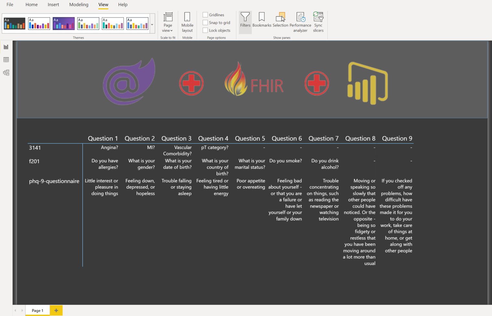
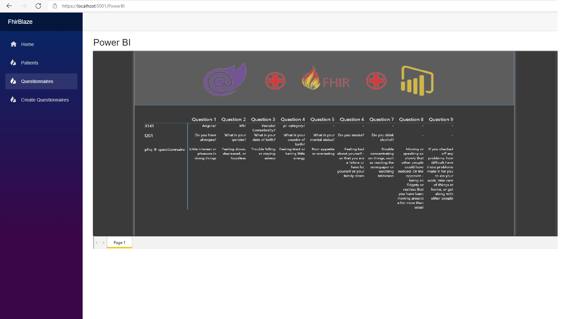

# Embedding Power BI in Blazor


# Table of contents


- [Project Title](#project-title)
- [Intro](#intro)
- [Demo-Preview](#demo-preview)
- [Table of contents](#table-of-contents)
- [Power Bi Configuration](#power-bi-configuration)
	- [Power BI Embedded](#power-bi-embedded)
- [Blazor Webassembly](#blazor-webassembly)
- [Usage](#usage)
# Power BI Configuration


Integration with PowerBI is easy to set up. We need reference to the **Microsoft.PowerBI.Api** NuGet package and some coding part JS and part C#  to get reports integrated to your Blazor webassembly app. But first you need a report, and before a report you need to connect your FHIR server to Power BI,  you can read how to connect it [here](https://docs.microsoft.com/en-us/power-query/connectors/fhir/fhir#connect-to-fhir-server) . Once connected you can easily extract the data from your FHIR server and build a [report](https://docs.microsoft.com/en-us/power-bi/create-reports/) like the one in the following figure:


{ align=center }

[(Back to top)](#table-of-contents)

## Power BI Embedded
In order to make Power BI integration work we need to register othe application on Azure AD and get some IDs.

First we need to register the web application in Power BI. You can do it at address  [https://dev.powerbi.com/apps](https://dev.powerbi.com/apps). Log in, fill registration form and click Register.  

Next step is get the parameters to embedd the Power BI report as shown [here](https://docs.microsoft.com/en-us/power-bi/developer/embedded/embed-sample-for-customers?tabs=net-core#step-5---get-the-embedding-parameter-values).
The way Power BI embedded report is rendered is that the server sends the Power BI configuration settings for the report in a workspace specified by the user. The user uses these configuration settings and renders the Power BI report client side through JavaScript by calling  `powerbi.embed(htmlContainer, reportConfigSettings)`

This produces an iFrame which connects to the Power BI Service directly, providing interactive reports and visuals. Actually all the interactions that happens inside the iFrame are handled by the Power BI service itself  and not by any of the servers that runs the Blazor app.

[(Back to top)](#table-of-contents)


# Blazor Webassembly
First Install the **Microsoft.PowerBI.Api** package, after this, the next step is to add the  **powerbi.min.js**  file to the  **wwwroot/js**  directory. You can get that file from here:  [https://github.com/microsoft/PowerBI-JavaScript/releases](https://github.com/microsoft/PowerBI-JavaScript/releases)
Next open the  **index.html**  file.

Add the following code to reference the  **powerbi.min.js**  file:

    <script src="js/powerbi.min.js"></script>
 Along with the following code to render the report:
 
```
 <script  window.ShowMyPowerBI = {
            showReport: function (reportContainer, accessToken, embedUrl, embedReportId) {

                var models = window['powerbi-client'].models;

                // This also includes settings and options such as filters.
                // You can find more information at https://github.com/Microsoft/PowerBI-JavaScript/wiki/Embed-Configuration-Details.
                
                var config = {
                    type: 'report',
                    tokenType: models.TokenType.Embed,
                    accessToken: accessToken,
                    embedUrl: embedUrl,
                    id: embedReportId,
                    permissions: models.Permissions.All,
                    settings: {
                        filterPaneEnabled: true,
                        navContentPaneEnabled: true
                    }
                };

                // Embed the report and display it within the div container.
                powerbi.embed(reportContainer, config);
            }
        };
    </script> 
```
Next, just open the **appsettings.json** file and add the following configurations:


```
"PowerBI": {

    "ApplicationId": "{{ YOUR SETTING }}",
    "ApplicationSecret": "{{ YOUR SETTING }}",
    "ReportId": "{{ YOUR SETTING }}",
    "WorkspaceId": "{{ YOUR SETTING }}",
    "AuthorityUrl": "{{ YOUR SETTING }}", // Normally is https://login.microsoftonline.com/TENANTID
    "ResourceUrl": "https://analysis.windows.net/powerbi/api",
    "ApiUrl": "https://api.powerbi.com/",
    "EmbedUrlBase": "https://app.powerbi.com/",
    "UserName": "{{ YOUR SETTING }}",
    "Password": "{{ YOUR SETTING }}"

  }
```
In ordeer to make C# "talk" to Javascript, we need to add a new class: Interop.cs using the following code: 
```
using Microsoft.AspNetCore.Components;
using Microsoft.JSInterop;
using System.Threading.Tasks;
namespace FhirBlaze
{
    public static class Interop
    {
        internal static ValueTask<object> CreateReport(
            IJSRuntime jsRuntime,
            ElementReference reportContainer,
            string accessToken,
            string embedUrl,
            string embedReportId)
        {
            return jsRuntime.InvokeAsync<object>(
                "ShowMyPowerBI.showReport",
                reportContainer, accessToken, embedUrl
                embedReportId);
        }   
    }
}
```


Finally, create your **PowerBI.razor** page!!  using the following code:
```
@page "/PowerBI"
@using System.Net.Http
@using System.Threading.Tasks
@using Microsoft.PowerBI.Api.V2
@using Microsoft.PowerBI.Api.V2.Models
@using Microsoft.Rest
@using Newtonsoft.Json.Linq
@using Microsoft.Extensions.Configuration
@using Microsoft.JSInterop
@using FhirBlaze.Data
@inject IJSRuntime JSRuntime
@inject IConfiguration _configuration

<h3>Power BI</h3>

<div @ref="@PowerBIElement" style="height: 600px;width: 100%;max-width: 2000px;" />

@code {
    private ElementReference PowerBIElement;

    protected override async Task
        OnAfterRenderAsync(bool firstRender)
    {
        if (firstRender)
        {
            var accessToken = await GetPowerBIAccessToken();
            var tokenCredentials = new TokenCredentials(accessToken, "Bearer");

            using (var client = new PowerBIClient(new Uri(_configuration["PowerBI:ApiUrl"]), tokenCredentials))
            {
                var workspaceId = _configuration["PowerBI:WorkspaceId"];
                var reportId = _configuration["PowerBI:ReportId"];
                var report = await client.Reports.GetReportInGroupAsync(workspaceId, reportId);
                var generateTokenRequestParameters = new GenerateTokenRequest(accessLevel: "view");
                var tokenResponse = await client.Reports.GenerateTokenAsync(workspaceId, reportId, generateTokenRequestParameters);

                await Interop.CreateReport(
                    JSRuntime,
                    PowerBIElement,
                    tokenResponse.Token,
                    report.EmbedUrl,
                    report.Id);
            }
        }
    }

    private async Task<string> GetPowerBIAccessToken()
    {
        using (var client = new HttpClient())
        {
            var form = new Dictionary<string, string>();
            form["grant_type"] = "password";
            form["resource"] = _configuration["PowerBI:ResourceUrl"];
            form["username"] = _configuration["PowerBI:UserName"];
            form["password"] = _configuration["PowerBI:Password"];
            form["client_id"] = _configuration["PowerBI:ApplicationId"];
            form["client_secret"] = _configuration["PowerBI:ApplicationSecret"];
            form["scope"] = "https://analysis.windows.net/powerbi/api/.default";

            client.DefaultRequestHeaders.TryAddWithoutValidation("Content-Type", "application/x-www-form-urlencoded");

            using (var formContent = new FormUrlEncodedContent(form))
            using (var response = await client.PostAsync(_configuration["PowerBI:AuthorityUrl"], formContent))
            {
                var body = await response.Content.ReadAsStringAsync();
                var jsonBody = JObject.Parse(body);

                var errorToken = jsonBody.SelectToken("error");
                if (errorToken != null)
                {
                    throw new Exception(errorToken.Value<string>());
                }

                return jsonBody.SelectToken("access_token").Value<string>();
            }
        }
    }
}
```


[(Back to top)](#table-of-contents)

# Usage

After all these steps you should be able to run your project normally and show the report like the following image:
[(Back to top)](#table-of-contents)

{ align=center }
