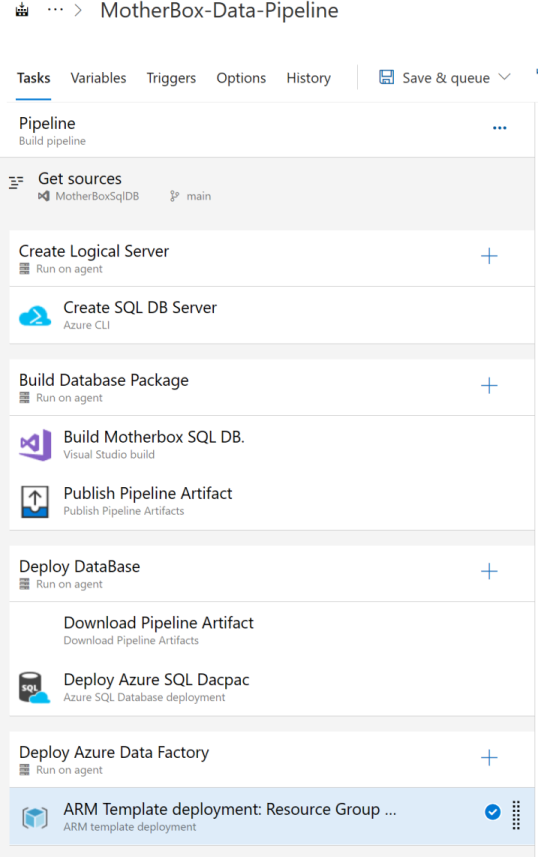

## Overview
The Motherbox application is composed of Azure resources responsible for sourcing, processing and landing data from our usage data:

- Azure Data Factory
- Azure Key Vault
- Azure SQL Database (Hyperscale)

In this section, we will provide an overview of how the application is architected and built.

### Data Overview
Motherbox data is stored in a traditional star schema. There are two fact tables that store current year (GlobalUsageDaily) and previous year (GlobalUsageDailyPrevYear) usage data. Supporting these tables are four dimension tables for Customer, Subscription, Service Hierachy and Date data.

Given the large dataset (thank you, customers!), the database is built on Azure SQLDB HyperScale. The database is dynamically scaled up just before the data load in order to minimize load times and when the load is complete, it scales back down.

### Security
All credentials used by ADF to connect to our internal system as well to the database are stored in Azure Key Vault. Azure Managed Identities are used to grant ADF permissions to Azure resources as needed.

### ADF Overview
The data is extracted from our internal system using Kusto queries and it's initially stored in staging tables on the Azure SQLDB database. The data is then aggregated and moved to the final SQLDB tables. This task is accomplished by an ADF job that's implemented as a series of pipelines. The core/master pipeline is designed as follows:

### Azure DevOps Overview
In order to simplify the deployment and operational maintenance, we built an Azure Devops pipeline that deploys changes committed to the git repository. We built a multi-stage pipeline that builds out the complete infrastructure. The overview below shows the various tasks used to build out the pipeline.

